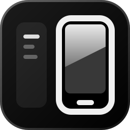
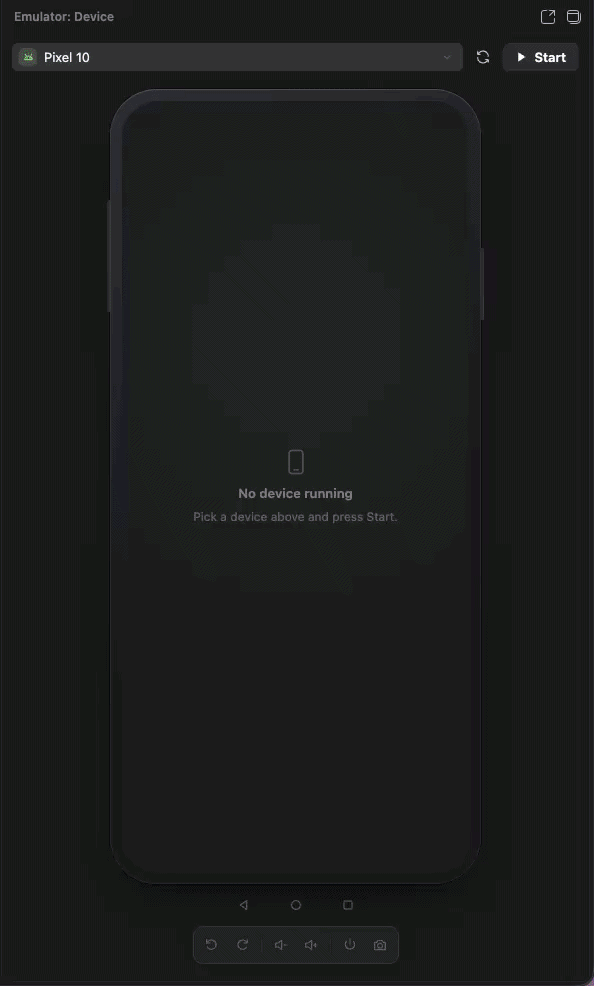

<p align="center">
  
</p>

<samp>
  <h1 align="center">Emulator in VS Code Panel</h1>
</samp>

<h4 align="center">
  <samp>VS Code extension that runs the Android Emulator and the iOS Simulator headless <br> and controls the device screen inside the sidebar, like Android Studio's "Running Devices".</samp>
</h4>

<p align="center">
  <a href="https://izakdvlpr.github.io/emulator-in-vscode-panel/"></a>
  <a href="https://github.com/izakdvlpr/emulator-in-vscode-panel"></a>
  <a href="https://github.com/izakdvlpr/emulator-in-vscode-panel/issues"></a>
  <br>
  <a href="https://izakdvlpr.github.io/emulator-in-vscode-panel/en/docs/requirements"></a>
  <a href="https://izakdvlpr.github.io/emulator-in-vscode-panel/en/docs/ios"></a>
</p>

<p align="center">
  
</p>

## <samp>Quick start</samp>

```bash
bun install
bun run install:local   # build + .vsix + install into VS Code
```

<samp>Then run <b>Developer: Reload Window</b> in VS Code and the Emulator icon shows up in the Activity Bar.</samp>

## <samp>Documentation</samp>

<samp>

- [Requirements](https://izakdvlpr.github.io/emulator-in-vscode-panel/en/docs/requirements): What needs to be installed before the first build.
- [Install](https://izakdvlpr.github.io/emulator-in-vscode-panel/en/docs/install): Local build, `.vsix` packaging and installing it into VS Code.
- [Usage](https://izakdvlpr.github.io/emulator-in-vscode-panel/en/docs/usage): Open the panel, boot a device and run several at once.
- [Controls](https://izakdvlpr.github.io/emulator-in-vscode-panel/en/docs/controls): Touch, gestures, device buttons, keyboard, clipboard and where the screen can live.
- [Settings](https://izakdvlpr.github.io/emulator-in-vscode-panel/en/docs/settings): Extension settings, read straight from the manifest.
- [Scripts](https://izakdvlpr.github.io/emulator-in-vscode-panel/en/docs/scripts): The `package.json` scripts and what each one does.
- [How it works](https://izakdvlpr.github.io/emulator-in-vscode-panel/en/docs/architecture): From the emulator process to the webview canvas: video, input, attach and clipboard.
- [iOS Simulator](https://izakdvlpr.github.io/emulator-in-vscode-panel/en/docs/ios): The Swift helper, Xcode private frameworks and the same video path as Android.
- [Shutdown](https://izakdvlpr.github.io/emulator-in-vscode-panel/en/docs/shutdown): Stop, Detach, closing the window and what happens if the extension host dies.
- [Known limitations](https://izakdvlpr.github.io/emulator-in-vscode-panel/en/docs/limitations): What does not work yet and where behaviour comes from Android or Xcode.
- [Roadmap](https://izakdvlpr.github.io/emulator-in-vscode-panel/en/docs/roadmap): What landed in phases 2 and 3 and what was dropped.

</samp>
